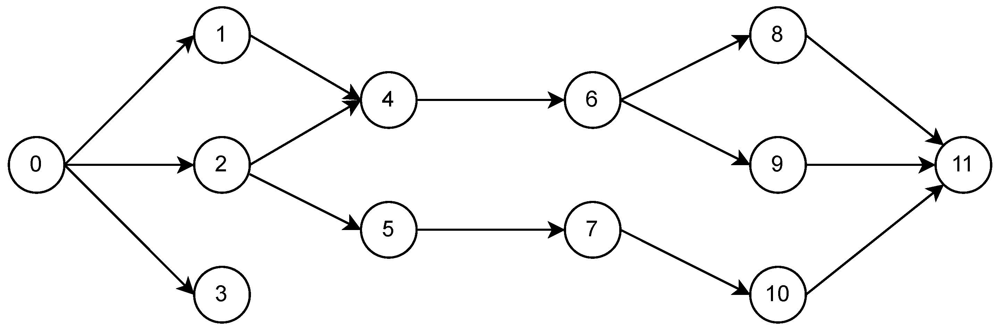

<h1 align='center'>Connex</h1>

Connex is a [JAX](https://github.com/google/jax) library built on [Equinox](https://github.com/patrick-kidger/equinox) that allows for fine-grained, dynamic control of neural network topology. With Connex, you can

- Turn any directed acyclic graph (DAG) into a trainable neural network.
- Add and remove both connections and neurons at the individual level.
- Set and modify dropout probabilities for all neurons individually.
- Easily toggle techniques such as normalization, adaptive activations, and self-attention.
- Export a trained network to a NetworkX weighted digraph for network analysis.

## Installation

```bash
pip install connex
```

## Usage

As a tiny pedagogical example, let's create a trainable neural network from the following DAG



with input neuron 0 and output neurons 3 and 11 (in that order) and ReLU activation for the hidden neurons:

```python
import connex as cnx
import jax.nn as jnn


# Create the graph data
adjacency_dict = {
    0: [1, 2, 3],
    1: [4],
    2: [4, 5],
    4: [6],
    5: [7],
    6: [8, 9],
    7: [10],
    8: [11],
    9: [11],
    10: [11]
}

# Specify the input and output neurons
input_neurons = [0]
output_neurons = [3, 11]

# Create the network
network = cnx.NeuralNetwork(
    adjacency_dict,
    input_neurons, 
    output_neurons,
    jnn.relu
)
```

That's it! A `connex.NeuralNetwork` is a subclass of `equinox.Module`, so it can be trained as such:

```python
import equinox as eqx
import jax
import jax.numpy as jnp
import optax

# Initialize the optimizer
optim = optax.adam(1e-3)
opt_state = optim.init(eqx.filter(network, eqx.is_array))

# Define the loss function
@eqx.filter_value_and_grad
def loss_fn(model, x, y):
    preds = jax.vmap(model)(x)
    return jnp.mean((preds - y) ** 2)

# Define a single training step
@eqx.filter_jit
def step(model, opt_state, x, y):
    loss, grads = loss_fn(model, x, y)
    updates, opt_state = optim.update(grads, opt_state, model)
    model = eqx.apply_updates(model, updates)
    return model, opt_state, loss

# Toy data
x = jnp.expand_dims(jnp.linspace(0, 2 * jnp.pi, 250), 1)
y = jnp.hstack((jnp.cos(x), jnp.sin(x)))

# Training loop
n_epochs = 500
for epoch in range(n_epochs):
    network, opt_state, loss = step(network, opt_state, x, y)
    print(f"Epoch: {epoch}   Loss: {loss}")
```

Now suppose we wish to add connections 1 &rarr; 6 and 2 &rarr; 11, remove neuron 9, and set the dropout probability of all hidden neurons to 0.1:

```python
# Add connections
network = cnx.add_connections(network, [(1, 6), (2, 11)])

# Remove neuron
network = cnx.remove_neurons(network, [9])

# Set dropout probability
network = cnx.set_dropout_p(network, 0.1)
```

That's all there is to it.  The new connections have been initialized with untrained parameters, and the neurons in the original network that have not been removed (along with their respective incoming and outgoing connections) have retained their trained parameters.

For more information about manipulating connectivity structure and the `NeuralNetwork` base class, please see the API section of the documentation. For examples of subclassing `NeuralNetwork`, please see `connex.nn`.

## Citation

```bibtex
@software{gleyzer2023connex,
  author = {Leonard Gleyzer},
  title = {{C}onnex: Fine-grained Control over Neural Network Topology in {JAX}},
  url = {http://github.com/leonard-gleyzer/connex},
  year = {2023},
}
```