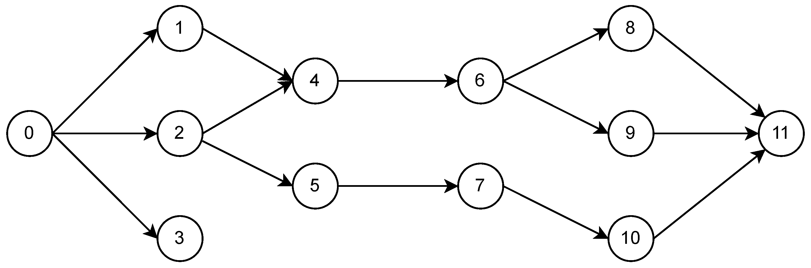

# Getting Started

Connex is a [JAX](https://github.com/jax-ml/jax) library built on
[Equinox](https://github.com/patrick-kidger/equinox) for trainable neural
networks whose topology is defined by a directed acyclic graph.

With Connex, you can:

- turn any directed acyclic graph (DAG) into a trainable Equinox module;
- add and remove individual edges and neurons while preserving compatible
  parameters;
- set global or per-node dropout probabilities with explicit JAX random keys;
- compose built-in or user-defined graph operations;
- choose padded, sparse, matmul, or hybrid affine backends;
- export a trained model to a NetworkX weighted digraph for graph analysis.

## Installation

```bash
uv add connex
```

## A Small DAG

As a pedagogical example, consider the following graph:



The model has input node `0` and output nodes `3` and `11`, in that order. The
output order matters: Connex returns output values in the same order specified
in the graph specification.

```python
import connex as cnx
import jax
import jax.numpy as jnp
import jax.random as jr

graph = {
    0: [1, 2, 3],
    1: [4],
    2: [4, 5],
    4: [6],
    5: [7],
    6: [8, 9],
    7: [10],
    8: [11],
    9: [11],
    10: [11],
}

spec = cnx.GraphSpec(graph, inputs=[0], outputs=[3, 11])
model = cnx.NeuralDAG(
    spec,
    ops=cnx.ops.default_ops(activation=jax.nn.relu),
    key=jr.key(0),
)

y = model(jnp.array([1.0]))
```

`GraphSpec` validates the graph before any parameters are created. The graph
must be acyclic, input nodes may not have incoming edges, output nodes may not
have outgoing edges, and the optional `topo_sort` must respect every edge.

## Training

`NeuralDAG` is an `equinox.Module`, so it works with normal Equinox filtering,
JAX transformations, and Optax optimizers. Use `model.batched(x)` when each
example in a batch can share the same runtime state. Use `jax.vmap(model)` when
you need distinct stochastic state per example, such as independent dropout
keys.

```python
import equinox as eqx
import optax

optim = optax.adam(1e-3)
opt_state = optim.init(eqx.filter(model, eqx.is_array))


@eqx.filter_value_and_grad
def loss_fn(model, x, y):
    preds = model.batched(x)
    return jnp.mean((preds - y) ** 2)


@eqx.filter_jit
def step(model, opt_state, x, y):
    loss, grads = loss_fn(model, x, y)
    updates, opt_state = optim.update(grads, opt_state, model)
    model = eqx.apply_updates(model, updates)
    return model, opt_state, loss


x = jnp.expand_dims(jnp.linspace(0, 2 * jnp.pi, 250), 1)
y = jnp.hstack((jnp.cos(x), jnp.sin(x)))

for _ in range(500):
    model, opt_state, loss = step(model, opt_state, x, y)
```

## Dropout

Dropout is explicit-key only. If any dropout probability is nonzero, pass a key
to each forward call. A scalar dropout probability applies to hidden nodes. A
mapping can target any node, including inputs and outputs.

```python
spec = cnx.GraphSpec(graph, inputs=[0], outputs=[3, 11], dropout=0.1)
model = cnx.NeuralDAG(spec, key=jr.key(0))

y = model(jnp.array([1.0]), key=jr.key(1))
```

For independent masks per batch element, split the key and map over both inputs
and keys:

```python
keys = jr.split(jr.key(1), x.shape[0])
preds = jax.vmap(lambda x_i, key_i: model(x_i, key=key_i))(x, keys)
```

## Editing Topology

Topology edits go through `connex.edit(model)`. The editor mutates a pending
graph description, and `build(...)` returns a new `NeuralDAG`. The original
model is left unchanged. Compatible parameters are transferred by label: nodes
and edges that still exist keep their trained values, while new structure is
initialized from the supplied key.

```python
model = (
    cnx.edit(model)
    .add_edges([(1, 6), (2, 11)])
    .remove_nodes([9])
    .set_dropout(0.1)
    .build(key=jr.key(2))
)
```

Editors can add or remove edges, add input/hidden/output nodes, remove nodes,
and update dropout. The resulting graph is validated by `GraphSpec`, so edits
that introduce cycles or invalid input/output nodes fail before a model is
returned.

## Operation Pipelines

Connex models are composed from operation objects. The default stack is:

1. an affine op, usually `HybridEdgeAffine`;
2. an activation op;
3. dropout;
4. an output transform.

The hybrid affine backend chooses a representation per compiled topological
batch:

- padded predecessor rows for compact batches;
- sparse edge accumulation when padding dominates;
- dense matmul for wide complete predecessor batches.

Long one-input chain segments use an automatic `jax.lax.scan` execution plan
when the operation stack supports it. Scan segments only write graph outputs
and nodes consumed outside the segment back into the model value buffer.

You can force a backend for benchmarking or for a known graph family:

```python
model = cnx.NeuralDAG(
    spec,
    ops=cnx.ops.default_ops(affine="sparse", activation=jax.nn.relu),
    key=jr.key(0),
)
```

## Custom Operations

Subclass `connex.ops.Op` to add custom graph behavior. Operations receive a
`ForwardContext` containing the current topological batch, already-gathered
inputs, edge-position metadata, and the full value buffer. An operation can
transform inputs, produce outputs, or participate in parameter transfer.

```python
from dataclasses import replace


class ScaleOutputs(cnx.ops.Op):
    scale: jax.Array

    def apply(self, ctx, *, state=None, key=None):
        assert ctx.outputs is not None
        return replace(ctx, outputs=ctx.outputs * self.scale)
```

Custom operations intentionally use the generic topological batch path. The
scan execution path is reserved for built-in affine/activation/dropout stacks
whose semantics Connex can prove locally.

## Prebuilt Graphs

Prebuilt graph constructors live under `connex.nn`:

```python
mlp = cnx.nn.MLP(2, 1, width=32, depth=3, key=jr.key(0))
dense = cnx.nn.DenseMLP(2, 1, width=32, depth=3, key=jr.key(1))
```

These are regular `NeuralDAG` instances with generated `GraphSpec` objects, so
they can be edited, trained, exported, and composed with custom operations like
any other model.

## Citation

--8<-- "citation.md"
